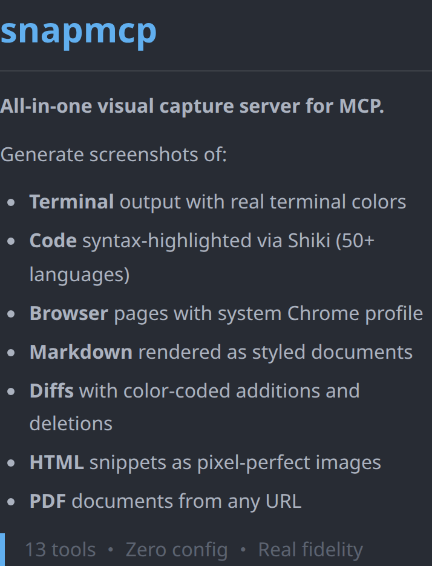

<p align="center">
  
</p>

<p align="center">
  <b>The visual documentation MCP server.</b><br/>
  Terminal · Code · Browser · Markdown · Diff · HTML · PDF · GIF<br/>
  <em>For documentation workflows — when structured snapshots aren't enough.</em>
</p>

<p align="center">
  <a href="https://www.npmjs.com/package/snapmcp"></a>
  <a href="https://www.npmjs.com/package/snapmcp"></a>
  <a href="https://github.com/reeinharddd/snapmcp/actions/workflows/ci.yml"></a>
  <a href="https://github.com/reeinharddd/snapmcp"></a>
  
</p>

---

Real terminal colors, Shiki-highlighted code, visual diffs, PDFs and GIFs — one MCP server, 13 tools, zero heavy dependencies. SSRF protection on by default. Built for agents that write documentation, not just drive browsers.

## Quick Start

Three steps, under two minutes:

**1. Install**

```bash
npm install -g snapmcp
# or run without installing: npx -y snapmcp
```

**2. Add to Claude Code** (`~/.claude/claude.json`)

```json
{
  "mcpServers": {
    "snapmcp": {
      "command": "npx",
      "args": ["-y", "snapmcp"],
      "env": {
        "SNAPMCP_DIR": "./captures",
        "SNAPMCP_THEME": "nord"
      }
    }
  }
}
```

**3. Capture**

Ask your agent in natural language:

> "Capture a terminal screenshot of `git log --oneline -5` and a syntax-highlighted PNG of `src/index.ts`."

The agent calls `capture_terminal` and `capture_file` — images land in `./captures/` with your real terminal theme and the chosen syntax theme applied.

<details>
<summary><strong>Other clients: OpenCode, VS Code / Cline, Docker</strong></summary>

**OpenCode** (`opencode.json`):

```json
{
  "mcpServers": {
    "snapmcp": {
      "command": "npx",
      "args": ["-y", "snapmcp"],
      "env": {
        "SNAPMCP_DIR": "./captures",
        "SNAPMCP_FORMAT": "jpeg",
        "SNAPMCP_QUALITY": "95"
      }
    }
  }
}
```

**VS Code / Cline / Roo-Cline** (`settings.json` → `cline.mcpServers`):

```json
{
  "mcpServers": {
    "snapmcp": {
      "command": "npx",
      "args": ["-y", "snapmcp"],
      "env": {
        "SNAPMCP_DIR": "./captures",
        "SNAPMCP_FORMAT": "jpeg"
      }
    }
  }
}
```

**Docker**:

```bash
docker run -i --rm \
  -e SNAPMCP_DIR=/captures \
  -e SNAPMCP_THEME=nord \
  -v /path/to/output:/captures \
  ghcr.io/reeinharddd/snapmcp
```
</details>

## What it looks like

<!-- TODO(demo assets): replace the static table below with three high-impact captures at the repo root:
     - assets/demo-terminal.png  — capture_terminal output of a real CLI session (ls -la + git log), Kitty/Gnome theme auto-detected, showing TRUE terminal colors (the unique selling point vs Playwright accessibility snapshots)
     - assets/demo-code.png      — capture_code output, a ~20-line TypeScript function, nord theme, window chrome on, soft shadow
     - assets/demo-diff.png      — capture_diff output of a real commit, green/red highlighting visible at a glance
     Optional fourth: assets/demo-gif.gif — capture_gif animating 3-4 frames of a terminal typing session.
     Until those exist, the real generated captures below serve as proof. -->

Real screenshots generated by snapmcp:

| Capture | Preview |
|---------|---------|
| Terminal (real detected colors) |  |
| Code (Shiki syntax) |  |
| Diff (green/red) |  |
| Markdown render |  |

## Why snapmcp vs Playwright MCP

Different tools for different jobs. Playwright MCP drives a browser through token-efficient accessibility snapshots; snapmcp renders pixel-faithful images for humans to read. If your agent needs to *click*, use Playwright. If it needs to *show*, use snapmcp.

| Use case | snapmcp | Playwright MCP |
|----------|:-------:|:--------------:|
| Terminal capture with real colors | ✅ auto-detects Kitty, Gnome, Alacritty, WezTerm themes | ❌ no terminal support |
| Code → syntax-highlighted image | ✅ Shiki, 50+ languages, 27 themes | ❌ not its purpose |
| Git diff → visual red/green image | ✅ `capture_diff` | ❌ |
| URL → PDF document | ✅ `capture_pdf` | ❌ |
| Animated GIF from captures | ✅ `capture_gif` (zero-dep gifenc) | ❌ |
| Markdown → styled document | ✅ `capture_markdown`, `capture_to_document` | ❌ |
| Browser page screenshot | ✅ `capture_browser` (full-page or viewport) | ✅ |
| Browser **automation** (click, fill, navigate) | ❌ screenshots only | ✅ accessibility-tree driven, token-efficient — the right tool for this |

Most documentation pipelines pair them: Playwright MCP to *interact*, snapmcp to *document*.

## Tools

| Tool | Description |
|------|-------------|
| `capture_terminal` | Terminal output with syntax-colored prompts (auto-detects real terminal theme) |
| `capture_code` | Syntax-highlighted code via Shiki (50+ languages, 27 themes) |
| `capture_browser` | Full-page or viewport screenshots (uses system Chrome profile when available) |
| `capture_file` | File → auto-detected language → highlighted screenshot |
| `capture_markdown` | Rendered markdown as a styled document |
| `capture_html` | Arbitrary HTML snippet rendered as image |
| `capture_diff` | Git diffs with green additions / red deletions |
| `capture_pdf` | URL → PDF document |
| `capture_batch` | Batch capture multiple items in one call |
| `capture_gif` | Animated GIF from multiple screenshots |
| `capture_sequence` | Side-by-side animated sequence |
| `capture_to_document` | Multi-section markdown document render |
| `snapmcp-hint` | Server capability hints for MCP clients |

## Use cases

**Automated documentation** — an agent writes a setup guide and embeds real captures: the terminal output of the install command (with your actual theme), the config file syntax-highlighted, the diff of the migration. One prompt, three `capture_*` calls, images saved next to the markdown.

**Visual QA** — after a UI change, the agent captures the affected pages with `capture_browser`, batches before/after with `capture_batch`, and assembles an animated comparison with `capture_gif` for the PR description.

**Terminal guides** — CLI tutorials where the screenshots must match what readers will see: `capture_terminal` reproduces the real prompt colors instead of a generic dark rectangle.

## Security

SSRF protection is **on by default** — no opt-in required.

| Feature | Description |
|---------|-------------|
| **SSRF Protection** | On by default (disable with `SNAPMCP_SSRF_PROTECTION=false`). Blocks IP literals (v4 + v6), localhost variants, and DNS names that resolve to private ranges (`127.0.0.0/8`, `10.0.0.0/8`, `172.16.0.0/12`, `192.168.0.0/16`, `fc00::/7`, `fe80::/10`, etc.); every page request (redirects included) is re-checked |
| **File Allowlist** | `SNAPMCP_ALLOWED_PATHS` defaults to deny-all when unset; only explicitly allowed paths can be captured |
| **Path Traversal** | Prevents `../` escapes, symlink traversal (via realpath), and null byte injection |
| **Input Limits** | Terminal 1000 lines; code/markdown/HTML 200KB; diff 500KB; file reads 5MB; max GIF frames 60; max GIF canvas 8192×8192 |
| **Audit Log** | Optional structured JSON log file with timestamped events |
| **Chromium Sandbox** | Sandbox availability checked at startup |

## Configuration

Environment variables for the MCP server:

| Variable | Default | Description |
|----------|---------|-------------|
| `SNAPMCP_DIR` | `./captures` | Output directory for captures |
| `SNAPMCP_THEME` | auto-detected | Syntax theme (27 built-in themes + auto-detected terminal) |
| `SNAPMCP_FORMAT` | `png` | Output format (`png`, `jpeg`) |
| `SNAPMCP_QUALITY` | `90` | JPEG quality (1-100) |
| `SNAPMCP_PADDING` | `32` | Content padding in pixels |
| `SNAPMCP_SHADOW` | `none` | Drop shadow (`none`, `soft`, `medium`, `strong`; aliases `sm`/`md`/`lg`) |
| `SNAPMCP_WINDOW_CHROME` | `false` | macOS-style title bar frame |
| `SNAPMCP_BORDER_RADIUS` | `0` | Window corner radius |
| `SNAPMCP_BADGE` | `false` | Footer badge |
| `SNAPMCP_LOG_FILE` | — | Audit log file path |
| `SNAPMCP_CHROME_EXECUTABLE` | — | Path to Chrome/Chromium binary |
| `SNAPMCP_CHROME_CHANNEL` | — | Chrome channel (`stable`, `beta`, `dev`, `canary`) |
| `SNAPMCP_CHROME_PROFILE` | — | Chrome profile directory name |
| `SNAPMCP_ALLOWED_PATHS` | (deny-all) | Comma- or semicolon-separated allowed file paths for `capture_file` |

27 built-in Shiki themes: `dracula`, `one-dark-pro`, `nord`, `tokyo-night`, `catppuccin-mocha`, `catppuccin-latte`, `ayu-dark`, `ayu-light`, `vitesse-dark`, `vitesse-light`, `min-dark`, `min-light`, `poimandres`, `rose-pine`, `rose-pine-moon`, `rose-pine-dawn`, `slack-dark`, `slack-ochin`, `snazzy-light`, `github-dark-dimmed`, `github-light`, `one-light`, `solarized-light`, `solarized-dark`, `material-theme`, `material-theme-lighter`, `material-theme-ocean`

## CLI

SnapMCP ships with a full CLI beyond the MCP server:

```
snapmcp        — Start the MCP server
snapmcp init   — Interactive setup wizard (detects Chrome, terminal theme, output dir)
snapmcp doctor — Health check: 7 checks across Node, Chromium, paths, env
snapmcp test   — Generate test captures (terminal + code) to verify the setup
```

## Documentation

| Page | Contents |
|------|----------|
| [Getting Started](docs/getting-started.md) | Installation, quick start, MCP client setup |
| [Tools Reference](docs/tools.md) | All 13 tools with parameters and examples |
| [Configuration](docs/configuration.md) | All SNAPMCP_* env vars, themes, defaults |
| [CLI Reference](docs/cli.md) | Init, doctor, test commands |
| [Guides](docs/guides/) | Terminal capture, browser capture, GIF animation |
| [ARCHITECTURE.md](./ARCHITECTURE.md) | Module map, data flow, security architecture |
| [CONTRIBUTING.md](./CONTRIBUTING.md) | Dev workflow, testing guidelines, PR checklist |

## Development

```bash
git clone https://github.com/reeinharddd/snapmcp
cd snapmcp
bun install
bun run build    # tsc → dist/
bun test         # 317 tests
```

Requirements: Node.js ≥ 20 or Bun ≥ 1.2. CI runs on ubuntu / macOS / windows via GitHub Actions.

## License

MIT — see [LICENSE](./LICENSE).
