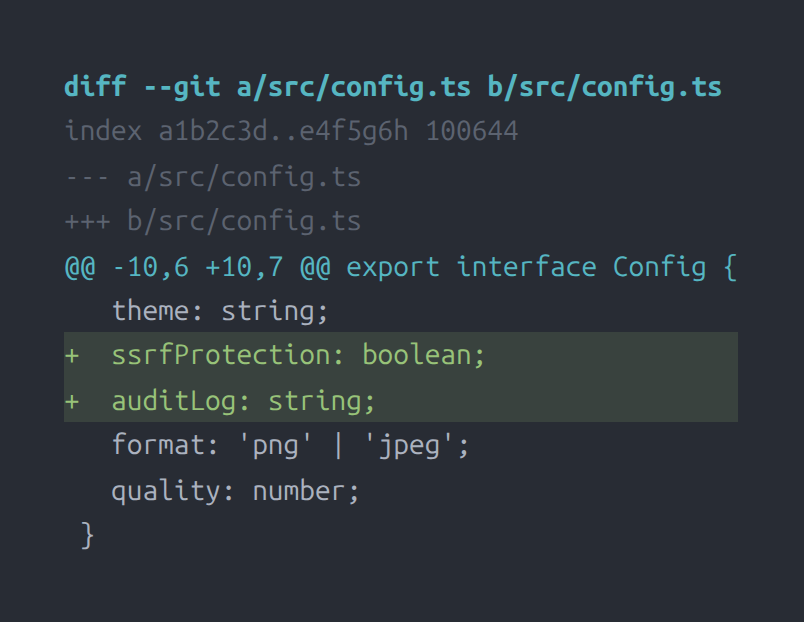
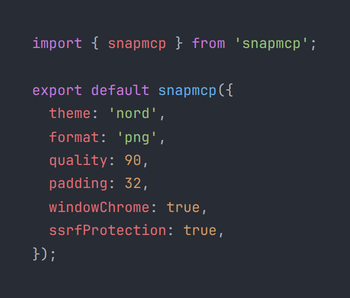

<p align="center">
  
</p>

<p align="center">
  <b>All-in-one MCP server for visual captures.</b><br/>
  Terminal · Code · Browser · Markdown · Diff · HTML · PDF · GIF<br/>
  <em>One server. 13 tools. Real fidelity. Zero juggling.</em>
</p>

<p align="center">
  <a href="https://www.npmjs.com/package/snapmcp"></a>
  <a href="https://github.com/reeinharddd/snapmcp"></a>
  
  
</p>

---

Generate screenshots of terminals, code, web pages, markdown, diffs, PDFs, and GIF animations — all through a single MCP server. **No more juggling 4 different MCP servers for your visual capture needs.**

## Features

| Tool | Description |
|------|-------------|
| `capture_terminal` | Terminal output with syntax-colored prompts (auto-detects real terminal theme) |
| `capture_code` | Syntax-highlighted code via Shiki (50+ languages, 27 themes) |
| `capture_browser` | Full-page or viewport screenshots (uses system Chrome profile when available) |
| `capture_file` | File → auto-detected language → highlighted screenshot |
| `capture_markdown` | Rendered markdown as a styled document |
| `capture_html` | Arbitrary HTML snippet rendered as image |
| `capture_diff` | Git diffs with green additions / red deletions |
| `capture_pdf` | URL → PDF document |
| `capture_batch` | Batch capture multiple items in one call |
| `create_gif` | Animated GIF from multiple screenshots |
| `create_sequence` | Side-by-side animated sequence |
| `capture_to_document` | Multi-section markdown document render |
| `snapmcp-hint` | Server capability hints for MCP clients |

## Documentation

Full reference documentation at **[docs/](docs/README.md)** — organized like a site with hyperlinks between pages:

| Page | Contents |
|------|----------|
| [Getting Started](docs/getting-started.md) | Installation, quick start, MCP client setup |
| [Tools Reference](docs/tools.md) | All 13 tools with parameters and examples |
| [Configuration](docs/configuration.md) | All SNAPMCP_* env vars, themes, defaults |
| [CLI Reference](docs/cli.md) | Init, doctor, test commands |
| [Guides](docs/guides/) | Terminal capture, browser capture, GIF animation |

### v2.2 Highlights

- **Real Terminal Colors** — detects Kitty, Gnome Terminal, Alacritty, WezTerm, Xfce4, and LXTerminal configs for authentic terminal captures
- **Real Browser Profile** — finds system Chrome/Edge/Brave installations and uses your real user data directory
- **In-Project Captures** — saves to `./captures` in your current project, not an isolated directory
- **SSRF Protection** — opt-in URL protection that blocks private/internal IP ranges (enable via `SNAPMCP_SSRF_PROTECTION=true`)
- **Audit Logging** — optional structured audit log file with timestamped events
- **Centralized Brand** — consistent teal/blue ANSI output across all CLI commands
- **Zero-Dep GIF** — migrated from gifencoder to gifenc + fast-png (7 fewer security vulnerabilities)
- **Interactive Setup** — guided wizard with dependency detection and configuration

## Quick Start

```bash
# Install globally
npm install -g snapmcp

# Start the server
snapmcp
```

Or run a quick health check:

```bash
# Run the interactive setup wizard
snapmcp init

# Check system readiness
snapmcp doctor

# Generate test captures
snapmcp test
```

## Installation Guides

<details>
<summary><strong>Claude Code</strong></summary>

Add to your `~/.claude/claude.json`:

```json
{
  "mcpServers": {
    "snapmcp": {
      "command": "npx",
      "args": ["-y", "snapmcp"],
      "env": {
        "SNAPMCP_DIR": "./captures",
        "SNAPMCP_THEME": "nord"
      }
    }
  }
}
```
</details>

<details>
<summary><strong>OpenCode</strong></summary>

Add to your `opencode.json`:

```json
{
  "mcpServers": {
    "snapmcp": {
      "command": "npx",
      "args": ["-y", "snapmcp"],
      "env": {
        "SNAPMCP_DIR": "./captures",
        "SNAPMCP_FORMAT": "jpeg",
        "SNAPMCP_QUALITY": "95"
      }
    }
  }
}
```
</details>

<details>
<summary><strong>VS Code / Cline / Roo-Cline</strong></summary>

Add to VS Code settings (`settings.json` → `cline.mcpServers`):

```json
{
  "mcpServers": {
    "snapmcp": {
      "command": "npx",
      "args": ["-y", "snapmcp"],
      "env": {
        "SNAPMCP_DIR": "./captures",
        "SNAPMCP_FORMAT": "jpeg"
      }
    }
  }
}
```
</details>

<details>
<summary><strong>Docker</strong></summary>

```bash
docker run -i --rm \
  -e SNAPMCP_DIR=/captures \
  -e SNAPMCP_THEME=nord \
  -v /path/to/output:/captures \
  ghcr.io/reeinharddd/snapmcp
```
</details>

## CLI Commands

SnapMCP ships with a full CLI beyond the MCP server:

```
snapmcp        — Start the MCP server
snapmcp init   — Interactive setup wizard
snapmcp doctor — Health check for all dependencies
snapmcp test   — Generate test captures (terminal + browser)
snapmcp --help — Show available tools and version
```

### `snapmcp init`

Interactive wizard that:
1. Detects system state (Chrome, Playwright, output directory, theme)
2. Guides you through configuration choices
3. Installs Chromium if missing
4. Prints a ready-to-use MCP config snippet

### `snapmcp doctor`

Runs 7 checks:
1. Node.js version ≥ 18
2. Playwright Chromium installed
3. Output directory writable
4. SnapMCP version
5. Chrome/Chromium detected
6. System terminal theme detected
7. Environment variables valid

### `snapmcp test`

Generates sample captures to verify everything works:
- `captures/test-terminal.png` — terminal screenshot
- `captures/test-code.png` — code screenshot

## Configuration

Environment variables for the MCP server:

| Variable | Default | Description |
|----------|---------|-------------|
| `SNAPMCP_DIR` | `./captures` | Output directory for captures |
| `SNAPMCP_THEME` | auto-detected | Syntax theme (27 built-in themes + auto-detected terminal) |
| `SNAPMCP_FORMAT` | `png` | Output format (`png`, `jpeg`) |
| `SNAPMCP_QUALITY` | `90` | JPEG quality (1-100) |
| `SNAPMCP_PADDING` | `32` | Content padding in pixels |
| `SNAPMCP_SHADOW` | `none` | Drop shadow (`none` only; legacy values ignored) |
| `SNAPMCP_WINDOW_CHROME` | `false` | macOS-style title bar frame |
| `SNAPMCP_BORDER_RADIUS` | `0` | Window corner radius |
| `SNAPMCP_BADGE` | `false` | Footer badge |
| `SNAPMCP_LOG_FILE` | — | Audit log file path |
| `SNAPMCP_CHROME_EXECUTABLE` | — | Path to Chrome/Chromium binary |
| `SNAPMCP_CHROME_CHANNEL` | — | Chrome channel (`stable`, `beta`, `dev`, `canary`) |
| `SNAPMCP_CHROME_PROFILE` | — | Chrome profile directory name |
| `SNAPMCP_ALLOWED_PATHS` | (deny-all) | Comma-separated allowed file paths for `capture_file` |

### Real Fidelity

SnapMCP detects your real environment for authentic captures.

**Terminal auto-detection** (in priority order):

| Source | Detection method |
|--------|-----------------|
| Kitty | `kitty.conf` (`foreground`, `background`, `tab_bar_style`) |
| Gnome Terminal | `dconf /org/gnome/terminal/legacy/profiles:/` |
| Alacritty | `alacritty.toml` / `alacritty.yml` (`colors.*`) |
| WezTerm | `wezterm.lua` (background detection) |
| Xfce4 Terminal | `xfce4/terminal/terminalrc` |
| LXTerminal | `lxterminal.conf` |
| COLORFGBG | Environment variable fallback |
| OS Theme | `gsettings` dark mode detection |

**Browser auto-detection** (in priority order):

1. `SNAPMCP_CHROME_EXECUTABLE` env var
2. System Chrome paths (Linux: `google-chrome`, `chromium-browser`; macOS: `/Applications/Google Chrome.app`; Windows: `%LOCALAPPDATA%\Google\Chrome`)
3. `which` / `where` PATH lookup
4. Edge / Brave / Chromium fallbacks
5. Bundled Playwright Chromium as final fallback

### Security

| Feature | Description |
|---------|-------------|
| **SSRF Protection** | Blocks private/internal IP ranges (opt-in via `SNAPMCP_SSRF_PROTECTION=true`). When enabled, blocks 127.0.0.0/8, 10.0.0.0/8, 172.16.0.0/12, 192.168.0.0/16, etc. |
| **File Allowlist** | `SNAPMCP_ALLOWED_PATHS` defaults to deny-all when unset; only explicitly allowed paths can be captured |
| **Path Traversal** | Prevents `../` escapes, symlink traversal, and null byte injection |
| **Input Limits** | Max URL length 5KB, max content 1MB, max GIF frames 100 |
| **Audit Log** | Optional structured JSON log file with timestamped events |
| **Chromium Sandbox** | Sandbox availability checked at startup |

### Themes

27 built-in Shiki themes:

`dracula`, `one-dark-pro`, `nord`, `tokyo-night`, `catppuccin-mocha`, `catppuccin-latte`, `ayu-dark`, `ayu-light`, `vitesse-dark`, `vitesse-light`, `min-dark`, `min-light`, `poimandres`, `rose-pine`, `rose-pine-moon`, `rose-pine-dawn`, `slack-dark`, `slack-ochin`, `snazzy-light`, `github-dark-dimmed`, `github-light`, `one-light`, `solarized-light`, `solarized-dark`, `material-theme`, `material-theme-lighter`, `material-theme-ocean`

## Example Output

```
captures/
├── test-terminal.png   # Terminal output with real detected colors
├── test-code.png       # Syntax-highlighted code
├── page.png            # Full-page browser screenshot
└── output.pdf          # URL converted to PDF
```

**Real screenshots generated by snapmcp:**

| Capture | Preview |
|---------|---------|
| Terminal |  |
| Code |  |
| Doctor |  |
| Init |  |
| Diff |  |
| Config |  |

## Architecture

```
src/
├── index.ts        — MCP server, 12 tool definitions, CLI entry
├── renderer.ts     — Capture engine (terminal, code, browser, PDF, GIF)
├── config.ts       — Config loader, defaults, 27 themes
├── cli.ts          — CLI commands (init, doctor, test)
├── security.ts     — SSRF denylist, path traversal, input limits
├── logger.ts       — Audit logging (AuditEvent, log file)
├── brand.ts        — Centralized brand tokens (colors, ANSI, logo)
├── terminal.ts     — Real terminal detection (Kitty/Gnome/Alacritty/WezTerm)
├── browser.ts      — System Chrome profile detection (8-step fallback)
├── setup-shared.ts — Shared bootstrap for interactive setup
├── document.ts     — Document render engine (brand-colored)
└── gif.ts          — GIF animation (gifenc + fast-png, zero deps)
```

## Development

```bash
git clone https://github.com/reeinharddd/snapmcp
cd snapmcp
bun install
bun run build    # tsc → dist/
bun test         # 240+ tests
```

### Docs

Full reference documentation in **[docs/](docs/README.md)**: getting started, tools reference, configuration, CLI, and guides.

### Project Documentation

- **[ARCHITECTURE.md](./ARCHITECTURE.md)** — Module map, data flow, key design decisions, security architecture, cross-platform support, and full MCP protocol reference. Required reading for anyone modifying the codebase.
- **[CONTRIBUTING.md](./CONTRIBUTING.md)** — Development workflow, coding principles, testing guidelines, and PR checklist.

### Requirements

- **Runtime**: Node.js ≥ 18 or Bun ≥ 1.0
- **TypeScript**: 5.x (ES2022, Node16 modules)

### CI

GitHub Actions runs on `ubuntu-latest`, `macos-latest`, `windows-latest` — bun only, no node matrix.

## License

MIT — see [LICENSE](./LICENSE).
