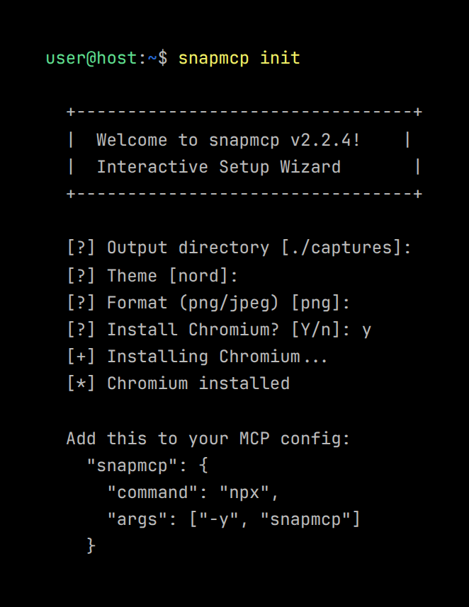
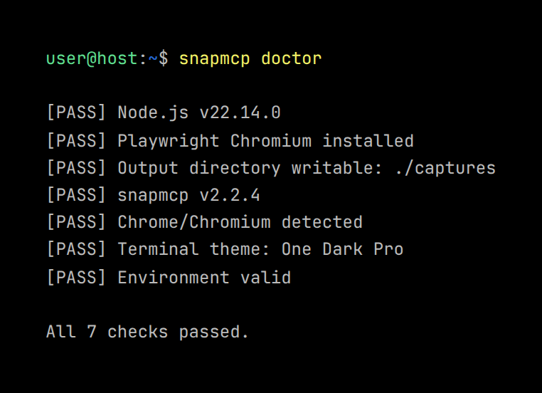
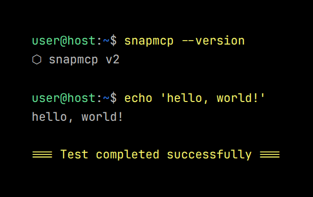
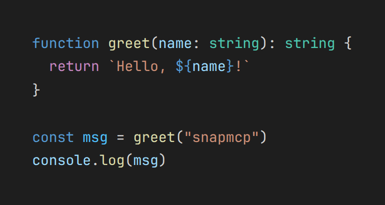

# CLI Commands Reference

## Overview

`snapmcp` is an MCP server that turns code, terminals, browsers, and markdown into
screenshots. It runs as a stdio-based MCP server for AI assistants, but also
provides utility commands for setup and testing.

## Commands

### `snapmcp` (no arguments)

Starts the MCP server on stdio. This is the primary mode. AI assistants like
Claude Desktop or OpenCode connect to this server to use the capture tools.

```bash
snapmcp
```

The server exposes all capture tools defined in [tools.md](tools.md). It reads
configuration from [environment variables](configuration.md).

### `snapmcp init`

Interactive setup wizard. It:

- Detects your operating system and shell
- Installs Chromium via `npx playwright install chromium` if missing
- Checks for Node.js and npm
- Configures MCP client settings for Claude Desktop, OpenCode, and Cursor
- Creates a default output directory

```bash
snapmcp init
```

Run this first if you're setting up snapmcp for the first time.

**Interactive wizard screenshot:**




### `snapmcp doctor`

Runs 7 health checks and reports results. Useful for diagnosing why captures
might not work.

```bash
snapmcp doctor
```

The checks:

1. **Node.js** -- verifies Node 18+ is installed
2. **Chromium** -- checks Playwright Chromium is installed
3. **Output directory** -- confirms the capture output directory exists and is
   writable
4. **Chrome binary** -- if using system Chrome, checks the binary path is valid
5. **Theme** -- validates the Shiki theme name in `SNAPMCP_THEME`
6. **Environment variables** -- checks for common misconfigurations
7. **Version** -- verifies the installed package matches the expected version

**`snapmcp doctor` output:**




### `snapmcp test`

Generates sample captures to verify the server works. Creates two files:

- `test-terminal.png` -- a terminal-style capture showing command output
- `test-code.png` -- a code screenshot with syntax highlighting

```bash
snapmcp test
```

These files appear in your configured output directory
([`SNAPMCP_DIR`](configuration.md#snapmcp_dir)).

**Generated test captures:**





### `snapmcp --help`

Prints usage information and lists all available commands.

```bash
snapmcp --help
```

### `snapmcp --version`

Prints the installed version number.

```bash
snapmcp --version
snapmcp v2.3.0
```

## Quick Start

If you haven't set up snapmcp yet, start here:

```bash
npx snapmcp init
npx snapmcp doctor    # verify everything works
npx snapmcp test       # generate sample captures
```

Then check [getting-started.md](getting-started.md) for the full guide.

## Related

- [Tools Reference](tools.md) -- all MCP capture tools and their parameters
- [Configuration](configuration.md) -- environment variables reference
- [Terminal Capture Guide](guides/terminal-capture.md) -- tips for terminal
  screenshots
- [Browser Capture Guide](guides/browser-capture.md) -- tips for web page
  screenshots
- [GIF Animation Guide](guides/gif-animation.md) -- creating animated captures
