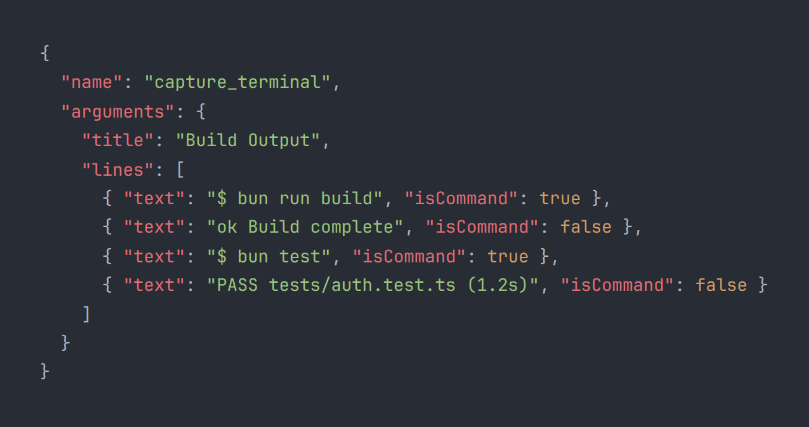

# Tools Reference

> **snapmcp v2.2.4** — All 13 MCP tools for visual captures.

Each tool is registered via `server.tool()` in `src/index.ts` and backed by a capture function in `src/renderer.ts` (images), `src/gif.ts` (animations), or `src/document.ts` (documents). Tools communicate over stdio using the Model Context Protocol.

All image-producing tools respect `SNAPMCP_FORMAT` (png/jpeg), `SNAPMCP_QUALITY`, `SNAPMCP_THEME`, `SNAPMCP_PADDING`, `SNAPMCP_SHADOW`, `SNAPMCP_WINDOW_CHROME`, and `SNAPMCP_BORDER_RADIUS` from [configuration.md](configuration.md) or the per-tool `opts` parameter.

---

## Shared Options

### ScreenshotOptions

These options control the visual appearance of rendered captures. They are accepted by all image-producing tools.

| Field | Type | Default | Description |
|-------|------|---------|-------------|
| `format` | `"png" | "jpeg"` | `"png"` | Output image format |
| `quality` | `number 1-100` | `90` | JPEG quality (only applies when format is jpeg) |
| `padding` | `number` | `32` | Inner padding in pixels around the content |
| `theme` | `string` | auto-detected | Shiki syntax theme name (27 themes available) |
| `windowChrome` | `boolean` | `false` | Show a macOS-style title bar frame |
| `shadow` | `boolean` | `false` | Render a drop shadow behind the window |
| `borderRadius` | `number 0-32` | `0` | Window corner radius in pixels |

### PdfOptions

| Field | Type | Default | Description |
|-------|------|---------|-------------|
| `fullPage` | `boolean` | `true` | Capture all scrollable content |
| `width` | `number 320-3840` | `1280` | Viewport width in pixels |
| `height` | `number 240-4096` | `800` | Viewport height in pixels |

### CaptureItem

A polymorphic type used by batch, sequence, and GIF tools. Each item describes one capture to produce.

| Field | Type | Required | Description |
|-------|------|----------|-------------|
| `type` | `"terminal" | "code" | "file" | "browser" | "markdown" | "html" | "diff"` | yes | Which capture tool to use |
| `params` | `Record<string, any>` | yes | Parameters forwarded to the underlying tool |
| `caption` | `string` | no | Visible label for this capture (batch/document only) |
| `label` | `string` | no | Internal label for this capture (sequence/GIF only) |

### SequenceOptions

| Field | Type | Default | Description |
|-------|------|---------|-------------|
| `compileGif` | `boolean` | `false` | Compile all frames into an animated GIF after capturing |
| `frameDelay` | `number 10-5000` | `800` | Delay between frames in milliseconds |
| `loop` | `boolean` | `true` | Whether the compiled GIF loops |

### GifOptions

| Field | Type | Default | Description |
|-------|------|---------|-------------|
| `frameDelay` | `number 10-5000` | `800` | Delay between frames in milliseconds |
| `loop` | `boolean` | `true` | Whether the GIF loops |

### DocumentSection

Describes one section in a generated document.

| Field | Type | Required | Description |
|-------|------|----------|-------------|
| `title` | `string` | no | Section heading |
| `description` | `string` | no | Descriptive text rendered as a paragraph |
| `imagePath` | `string` | no | Path to an existing PNG capture to embed |
| `caption` | `string` | no | Visible caption below the image |
| `code` | `string` | no | Optional code block to include |
| `codeLanguage` | `string` | no | Language for syntax highlighting in code blocks |

---

## Tool Reference

### 1. capture_terminal

Generate a styled terminal screenshot from text lines. Lines prefixed with `$ ` are rendered as command prompts (green), other lines as output.

**Parameters:**

| Parameter | Type | Required | Default | Description |
|-----------|------|----------|---------|-------------|
| `title` | `string` | yes | — | Window title shown in the terminal title bar |
| `lines` | `string[]` | yes | — | Lines to render. `$ ` prefix = command prompt |
| `opts` | `ScreenshotOptions` | no | — | Visual rendering options |

**Example:**

```json
{
  "name": "capture_terminal",
  "arguments": {
    "title": "deploy output",
    "lines": [
      "$ git push origin main",
      "Enumerating objects: 42, done.",
      "Counting objects: 100% (42/42), done.",
      "$ npm run build",
      "> build@1.0.0 build /app",
      "✓ Compiled successfully in 2.3s"
    ]
  }
}
```

**Example output:**




---

### 2. capture_code

Render source code with syntax highlighting using Shiki (50+ languages, 27 themes). Supports optional line number gutters.

**Parameters:**

| Parameter | Type | Required | Default | Description |
|-----------|------|----------|---------|-------------|
| `code` | `string` | yes | — | Source code to render |
| `language` | `string` | no | `"text"` | Programming language for highlighting |
| `title` | `string` | no | `"code"` | Window title |
| `startLine` | `number` | no | — | First line number to show in the gutter |
| `endLine` | `number` | no | — | Last line number to show in the gutter |
| `opts` | `ScreenshotOptions` | no | — | Visual rendering options |

**Example:**

```json
{
  "name": "capture_code",
  "arguments": {
    "code": "function fibonacci(n: number): number {\n  if (n <= 1) return n;\n  return fibonacci(n - 1) + fibonacci(n - 2);\n}",
    "language": "typescript",
    "title": "fibonacci.ts",
    "startLine": 1,
    "endLine": 5
  }
}
```

---

### 3. capture_browser

Take a screenshot of a URL using headless Chromium. Uses the system Chrome installation when available (auto-detected on Linux, macOS, and Windows), falling back to bundled Playwright Chromium.

**Parameters:**

| Parameter | Type | Required | Default | Description |
|-----------|------|----------|---------|-------------|
| `url` | `string` | yes | — | URL to capture |
| `fullPage` | `boolean` | no | `false` | Capture full scrollable page |
| `width` | `number` | no | `1280` | Viewport width in pixels (min: 320, max: 3840) |
| `height` | `number` | no | `800` | Viewport height in pixels (min: 240, max: 4096) |
| `opts` | `ScreenshotOptions` | no | — | Visual rendering options |

**Example:**

```json
{
  "name": "capture_browser",
  "arguments": {
    "url": "https://example.com",
    "fullPage": true,
    "width": 1440,
    "height": 900
  }
}
```

---

### 4. capture_file

Read a file from disk, auto-detect its language from the extension, and render a syntax-highlighted screenshot. Supports optional line range slicing.

**Supported extensions:** py, js, ts, tsx, jsx, sql, json, yml, yaml, md, html, css, sh, bash, zsh, go, c, cpp, cs, java, rb, php, rs, swift, kt, kts, toml, xml, txt, dockerfile, tf, diff, patch

**Parameters:**

| Parameter | Type | Required | Default | Description |
|-----------|------|----------|---------|-------------|
| `path` | `string` | yes | — | Absolute path to the file to capture |
| `startLine` | `number` | no | — | First line number to capture (1-indexed, inclusive) |
| `endLine` | `number` | no | — | Last line number to capture (1-indexed, inclusive) |
| `opts` | `ScreenshotOptions` | no | — | Visual rendering options |

**Example:**

```json
{
  "name": "capture_file",
  "arguments": {
    "filePath": "/home/user/project/src/index.ts",
    "startLine": 10,
    "endLine": 35
  }
}
```

---

### 5. capture_markdown

Render Markdown content as a styled document screenshot. Supports headings, lists, code blocks, tables, blockquotes, and inline formatting.

**Parameters:**

| Parameter | Type | Required | Default | Description |
|-----------|------|----------|---------|-------------|
| `content` | `string` | yes | — | Markdown content to render |
| `title` | `string` | no | `"document"` | Document title |
| `opts` | `ScreenshotOptions` | no | — | Visual rendering options |

**Example:**

```json
{
  "name": "capture_markdown",
  "arguments": {
    "content": "# API Design\n\n## Endpoints\n\n- `GET /users` — list users\n- `POST /users` — create user\n\n## Authentication\n\nAll requests require a Bearer token.",
    "title": "API Reference"
  }
}
```

---

### 6. capture_html

Render arbitrary HTML as a screenshot. Useful for custom UI mockups, charts, or any HTML content that needs pixel-perfect rendering.

**Parameters:**

| Parameter | Type | Required | Default | Description |
|-----------|------|----------|---------|-------------|
| `content` | `string` | yes | — | HTML content to render |
| `title` | `string` | no | `"html"` | Description (for logging) |
| `opts` | `ScreenshotOptions` | no | — | Visual rendering options |

**Example:**

```json
{
  "name": "capture_html",
  "arguments": {
    "html": "<div style='padding:2rem;font-family:sans-serif'><h1 style='color:#06b6d4'>Hello</h1><p>Rendered from raw HTML.</p></div>",
    "title": "custom card"
  }
}
```

---

### 7. capture_diff

Render a git diff with color-coded additions (green) and deletions (red). Accepts standard unified diff format.

**Parameters:**

| Parameter | Type | Required | Default | Description |
|-----------|------|----------|---------|-------------|
| `content` | `string` | yes | — | Diff content in git diff / unified diff format |
| `opts` | `ScreenshotOptions` | no | — | Visual rendering options |

**Example:**

```json
{
  "name": "capture_diff",
  "arguments": {
    "content": "--- a/src/main.ts\n+++ b/src/main.ts\n@@ -1,3 +1,4 @@\n-const x = 1;\n-console.log(x);\n+const x = 42;\n+const y = x * 2;\n+console.log(y);"
  }
}
```

**Example output:**


---

### 8. capture_pdf

Convert a URL to a PDF document using headless Chromium. Useful for generating printable documentation, reports, or archiving web pages.

**Parameters:**

| Parameter | Type | Required | Default | Description |
|-----------|------|----------|---------|-------------|
| `url` | `string` | yes | — | URL to convert to PDF |
| `fullPage` | `boolean` | no | `true` | Include all content |
| `width` | `number` | no | `1280` | Viewport width in pixels (min: 320, max: 3840) |
| `height` | `number` | no | `800` | Viewport height in pixels (min: 240, max: 4096) |
| `opts` | `PdfOptions` | no | — | PDF rendering options |

**Example:**

```json
{
  "name": "capture_pdf",
  "arguments": {
    "url": "https://example.com/docs",
    "fullPage": true,
    "width": 1280,
    "height": 800
  }
}
```

---

### 9. capture_batch

Capture multiple items in a single call. Each capture is processed sequentially. Supports up to 10 items per batch. Each item follows the `CaptureItem` schema with a `type` and `params` object matching the corresponding tool's parameters.

**Parameters:**

| Parameter | Type | Required | Default | Description |
|-----------|------|----------|---------|-------------|
| `items` | `CaptureItem[]` | yes | — | Array of captures to process (max: 10) |
| `opts` | `ScreenshotOptions` | no | — | Visual rendering options applied to all items |

**Example:**

```json
{
  "name": "capture_batch",
  "arguments": {
    "captures": [
      {
        "type": "terminal",
        "params": {
          "title": "install",
          "lines": ["$ npm install", "+ react@18.2.0", "+ typescript@5.3.0"]
        },
        "caption": "Dependency install"
      },
      {
        "type": "code",
        "params": {
          "code": "console.log('hello');",
          "language": "javascript",
          "title": "hello.js"
        },
        "caption": "Entry point"
      },
      {
        "type": "browser",
        "params": {
          "url": "https://example.com",
          "fullPage": false
        },
        "caption": "Landing page"
      }
    ]
  }
}
```

---

### 10. capture_gif

Create an animated GIF from 2 to 60 sequential captures. Each frame is captured first as a PNG image, then compiled into an animated GIF using gifenc + fast-png (zero heavyweight dependencies).

**Parameters:**

| Parameter | Type | Required | Default | Description |
|-----------|------|----------|---------|-------------|
| `title` | `string` | no | `"animation"` | Name for the GIF |
| `captures` | `CaptureItem[]` | yes | — | Array of captures to compile as frames (min: 2, max: 60) |
| `frameDelay` | `number` | no | `800` | Delay between frames in milliseconds (min: 10, max: 5000) |
| `loop` | `boolean` | no | `true` | Whether the GIF loops |
| `output` | `string` | no | auto-generated | Output filename for the GIF |

**Example:**

```json
{
  "name": "capture_gif",
  "arguments": {
    "title": "build pipeline",
    "captures": [
      {
        "type": "terminal",
        "params": { "title": "step 1", "lines": ["$ npm run lint", "✓ All checks passed"] },
        "label": "lint"
      },
      {
        "type": "terminal",
        "params": { "title": "step 2", "lines": ["$ npm run test", "PASS  tests/  (42 tests)", "✓ All tests passed"] },
        "label": "test"
      },
      {
        "type": "terminal",
        "params": { "title": "step 3", "lines": ["$ npm run build", "✓ Build complete"] },
        "label": "build"
      }
    ],
    "frameDelay": 1200,
    "loop": true
  }
}
```

---

### 11. capture_sequence

Capture each step of a process as individual image files, with an optional compiled GIF. Supports up to 60 steps. Each step can be a different capture type and receives a step number and optional label.

**Parameters:**

| Parameter | Type | Required | Default | Description |
|-----------|------|----------|---------|-------------|
| `steps` | `CaptureItem[]` | yes | — | Array of step captures (min: 1, max: 60), each may include `stepNumber` and `label` |
| `compileGif` | `boolean` | no | `false` | Compile all frames into an animated GIF after capturing |
| `frameDelay` | `number` | no | `800` | Delay between frames in milliseconds (min: 10, max: 5000) |
| `loop` | `boolean` | no | `true` | Whether the compiled GIF loops |
| `output` | `string` | no | auto-generated | Output directory |

**Example:**

```json
{
  "name": "capture_sequence",
  "arguments": {
    "steps": [
      {
        "type": "code",
        "params": {
          "code": "// Step 1: Define types\ntype User = { id: string; name: string; };\nconst users: User[] = [];",
          "language": "typescript",
          "title": "types.ts"
        },
        "stepNumber": 1,
        "label": "Types"
      },
      {
        "type": "code",
        "params": {
          "code": "// Step 2: Add CRUD functions\nfunction addUser(user: User) {\n  users.push(user);\n}",
          "language": "typescript",
          "title": "crud.ts"
        },
        "stepNumber": 2,
        "label": "Functions"
      },
      {
        "type": "terminal",
        "params": {
          "title": "test run",
          "lines": ["$ npm test", "PASS  src/users.test.ts", "✓ 3 tests passed"]
        },
        "stepNumber": 3,
        "label": "Verify"
      }
    ],
    "compileGif": true,
    "frameDelay": 1500
  }
}
```

---

### 12. capture_to_document

Create a self-contained document (Markdown, HTML, or PDF) with embedded captures. Each capture is taken as a screenshot, then embedded as a base64 data URI in the output document. Supports up to 30 sections.

**Parameters:**

| Parameter | Type | Required | Default | Description |
|-----------|------|----------|---------|-------------|
| `title` | `string` | yes | — | Document title (becomes the top-level heading) |
| `captures` | `CaptureItem[]` | yes | — | Array of captures to include as sections (min: 1, max: 30) |
| `format` | `"markdown" | "html" | "pdf"` | no | `"markdown"` | Output document format |
| `includeTimestamps` | `boolean` | no | `false` | Include a timestamp in the document |
| `output` | `string` | no | auto-generated | Output filename (.md, .html, or .pdf) |

**Example:**

```json
{
  "name": "capture_to_document",
  "arguments": {
    "title": "API Deployment Report",
    "format": "html",
    "includeTimestamps": true,
    "captures": [
      {
        "type": "terminal",
        "params": {
          "title": "build",
          "lines": ["$ npm run build", "✓ Build succeeded in 4.2s"]
        },
        "caption": "Build step"
      },
      {
        "type": "terminal",
        "params": {
          "title": "deploy",
          "lines": ["$ npx wrangler deploy", "✨ Deployment complete"]
        },
        "caption": "Deployment"
      },
      {
        "type": "browser",
        "params": {
          "url": "https://api.example.com/health",
          "fullPage": false
        },
        "caption": "Health check"
      }
    ]
  }
}
```

---

### 13. snapmcp-hint

Return a helpful hint about configuring and using snapmcp. No parameters required. Accepts an optional topic string to scope the hint.

**Parameters:**

| Parameter | Type | Required | Default | Description |
|-----------|------|----------|---------|-------------|
| `topic` | `string` | no | — | Optional topic: `init`, `doctor`, `browser`, `themes`, `output` |

**Example:**

```json
{
  "name": "snapmcp-hint",
  "arguments": {
    "topic": "themes"
  }
}
```

**Response:** `"Set SNAPMCP_THEME to one of 27 themes: dracula, nord, catppuccin-mocha, tokyo-night, and more."`

---

## Next Steps

- [Getting Started](getting-started.md) — installation and configuration
- [Configuration Reference](configuration.md) — all environment variables and options
- [CLI Reference](cli.md) — snapmcp init, doctor, test commands
- [ARCHITECTURE.md](../ARCHITECTURE.md) — internal module map and design decisions
